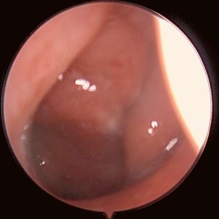
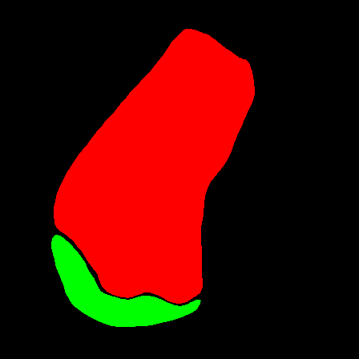
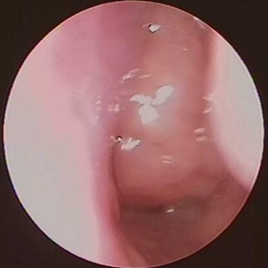
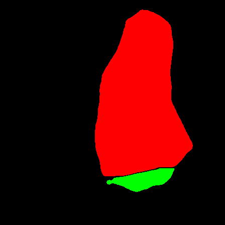
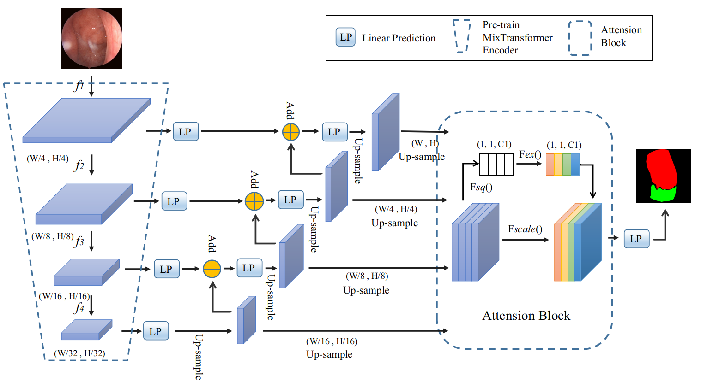

# A Demo for Adenoid Segmentation
This repository includes the code for a model based Transformer for automatic segmentation of adenoid and nasal.

### Task Description

       
In the preview pictures, the left pictures are Adenoid endoscopic images. And the right pictures are masked images annotated by experienced doctors. In these pictures, red areas mean adenoid and green areas mean nasal.

### Environment
- OS Version: Ubuntu 16.04
- CUDA Version: 10.2
- torch Version: 1.71

### Network Overview

### File Description
- `dataloader.py`: a packaged dataloader for preprocessing adenoid images.
- `model.py`: The encoder comprises four Mix Transformer blocks with four down-sampling scales. The decoder combines feature maps from different scales. And the SE module is used to reweight the channel weights.
- `metric.py`: computing Acc, Spe, Dice, IoU, F1.
- `loss.py`: a simple loss function.
- `train.py`: the train process.
- `test.py`: the test process.
- `deploy.py`: using `gradio` to deploy the model into a website.
- `utils.py`: other functions.

